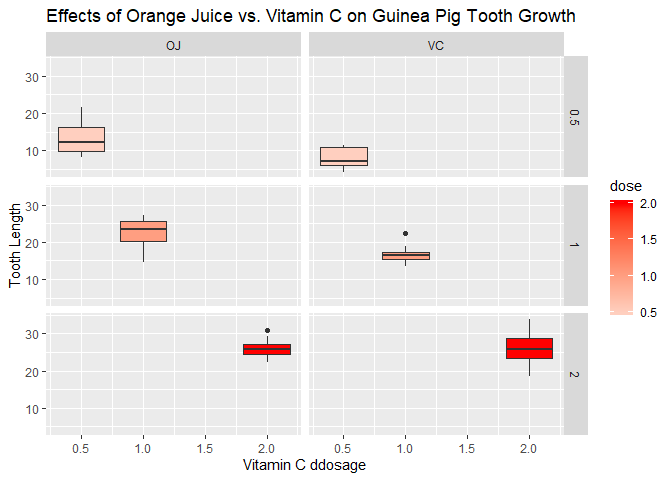

Visual Analytics Module 9 - Multivariate Analysis
================

The five principles of design that I will try to incorporate into my multivariate analysis are:

Alignment - Aligning the graphic elements to create a sharper and cleaner design.

Repetition - Repeats specific graphic elements to tie in the overall visualization.

Contrast - Uses different shades or coloring to highlight specific elements of the visualization.

Proximity - Displaces certain aspects of the graphic in order to organize or separate the visualization.

Balance - Distributes elements of the visualization in order to provide structure and neatness.

I will be using the default dataset from R 'iris' for my multivariate analysis and to answer the question: "Which supplement of Vitamin C increases guinea pig tooth growth the most?"

``` r
library(ggplot2)
ggplot(ToothGrowth, aes(x=dose, y=len, group=dose)) + geom_boxplot(aes(fill=dose))+facet_grid(dose~supp)+scale_fill_gradient2(high = "red")+labs(title = "Effects of Orange Juice vs. Vitamin C on Guinea Pig Tooth Growth", x = "Vitamin C ddosage",y = "Tooth Length")
```



``` r
#ggplot(mtcars, aes(x=mtcars$mpg, y=mtcars$mpg, color=mtcars$gear)) + geom_boxplot()+ labs(title ="Flower Species' affect on Petal Length and Width", x = "Petal Length", y = "Petal Width", color = "Flower Species")
```

We can see from the graph above that for smaller doses of Orange Juice compared to Vitamin C, Orange Juice seems to have the largest tooth growth for the guinea pigs. However, at larger doses, it evens out and there is not much of a difference in tooth growth.
